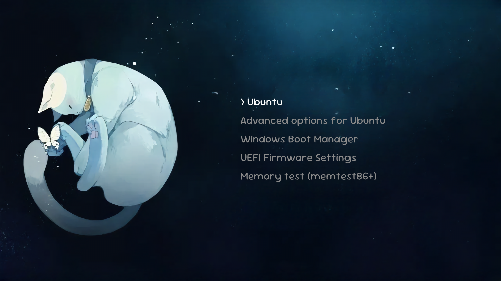

# Zzz GRUB Theme



## Credits

- Original background artwork: https://www.pixiv.net/en/artworks/96605330
- Install and uninstall scripts are based on: https://github.com/aspy606/minimal-grub-theme
- Fonts reference: https://fonts.google.com/share?selection.family=Dongle|Sour+Gummy:ital,wght@0,100..900;1,100..900

## Installation

```bash
cd Zzz-grub-theme
sudo ./install.sh
```

## Contents

- Theme installed to `/boot/grub*/themes/assets`
- Background image: `assets/background.png`
- Font generated during installation from `assets/original.ttf`
- GRUB timeout updated in `/etc/default/grub`

## Uninstallation

```bash
cd Zzz-grub-theme
sudo ./uninstall.sh
```
